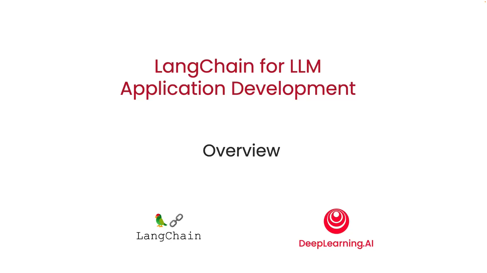
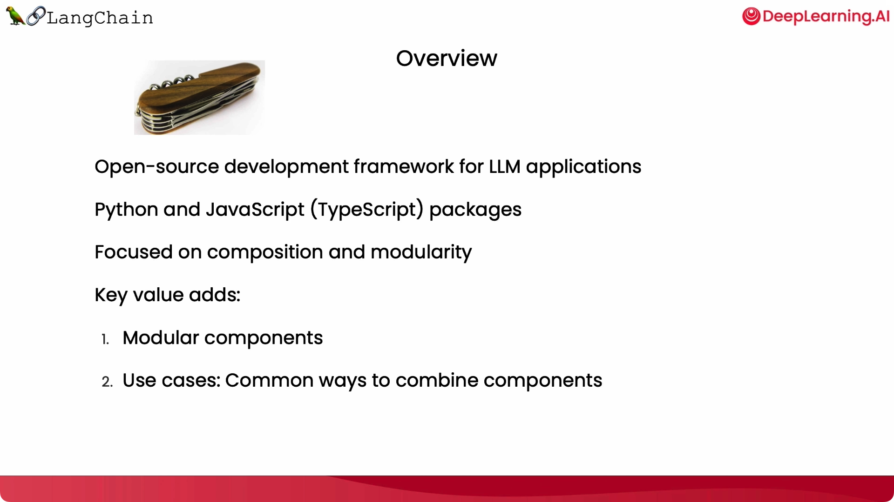
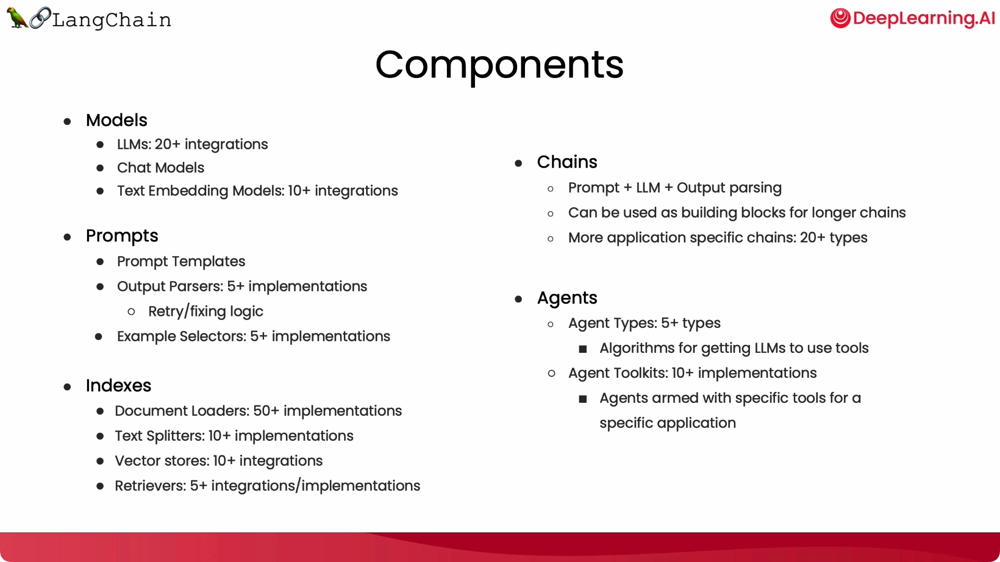

# LangChain for LLM Application Development

## 简介

本仓库是吴恩达与 [LangChain](https://github.com/hwchase17/langchain) 作者 [Harrison Chase](https://www.linkedin.com/in/harrison-chase-961287118) 联合推出的教学课程 《[LangChain for LLM Application Development](https://learn.deeplearning.ai/langchain/lesson/1/introduction)》的学习笔记。除了课程本身内容外，会提供一些个人的思考与整理。

## 快速开始

| 课程                                                         | Google Colab                                                        | 掘金                                                         |
| ------------------------------------------------------------ | ------------------------------------------------------------ | ------------------------------------------------------------ |
| [课程简介](https://github.com/madroidmaq/LangChain-for-LLM-Application-Development/blob/master/notebook/Intro.md) | --                                                           | [简介](https://juejin.cn/post/7240119814756958266)           |
| [课程1：模型, 提示词以及数据解析](https://github.com/madroidmaq/LangChain-for-LLM-Application-Development/blob/master/notebook/L1-Model_prompt_parser.ipynb) | [L1-Model_prompt_parser](https://colab.research.google.com/github/madroidmaq/LangChain-for-LLM-Application-Development/blob/master/notebook/L1-Model_prompt_parser.ipynb) | [模型, 提示词以及数据解析 ](https://juejin.cn/spost/7240636255973081144) |
| [课程2：记忆](https://github.com/madroidmaq/LangChain-for-LLM-Application-Development/blob/master/notebook/L2-Memory.ipynb) | [L2-Memory](https://colab.research.google.com/github/madroidmaq/LangChain-for-LLM-Application-Development/blob/master/notebook/L2-Memory.ipynb) | [记忆](https://juejin.cn/spost/7243252896392839225)          |
| [课程3：链接](https://github.com/madroidmaq/LangChain-for-LLM-Application-Development/blob/master/notebook/L3-Chains.ipynb) | [L3-Chains](https://colab.research.google.com/github/madroidmaq/LangChain-for-LLM-Application-Development/blob/master/notebook/L3-Chains.ipynb) | TODO                                                         |
| [课程4：问答](https://github.com/madroidmaq/LangChain-for-LLM-Application-Development/blob/master/notebook/L4-QnA.ipynb) | [L4-QnA](https://colab.research.google.com/github/madroidmaq/LangChain-for-LLM-Application-Development/blob/master/notebook/L4-QnA.ipynb) | TODO                                                         |
| [课程5：评估](https://github.com/madroidmaq/LangChain-for-LLM-Application-Development/blob/master/notebook/L5-Evaluation.ipynb) | [L5-Evaluation](https://colab.research.google.com/github/madroidmaq/LangChain-for-LLM-Application-Development/blob/master/notebook/L5-Evaluation.ipynb) | TODO                                                         |
| [课程6：代理](https://github.com/madroidmaq/LangChain-for-LLM-Application-Development/blob/master/notebook/L6-Agents.ipynb) | [L6-Agents](https://colab.research.google.com/github/madroidmaq/LangChain-for-LLM-Application-Development/blob/master/notebook/L6-Agents.ipynb) | TODO                                                         |

## 图解

### 课程简介

### Prompt/Model/Output

