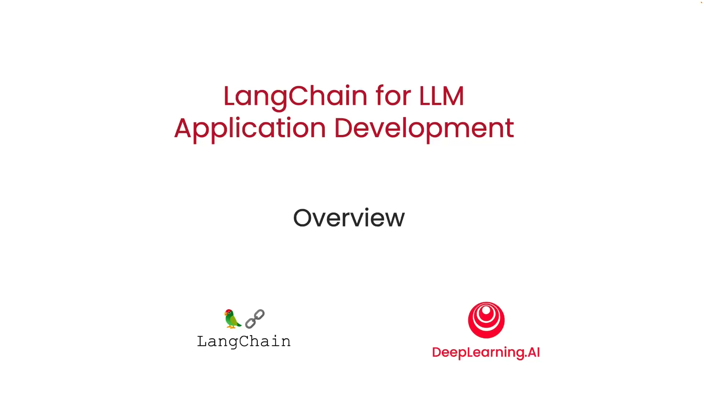
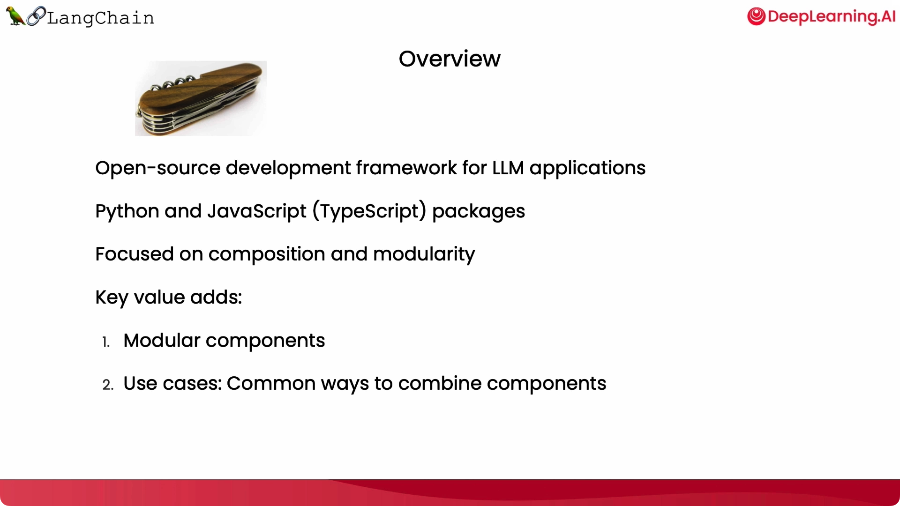
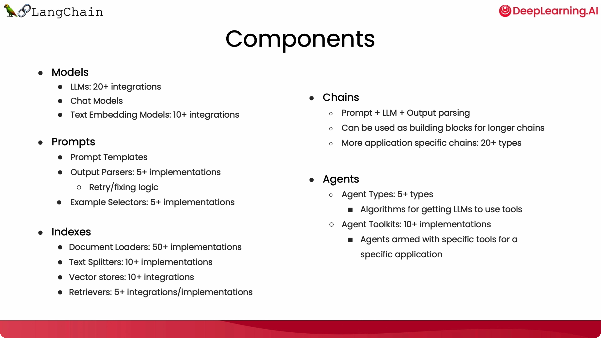
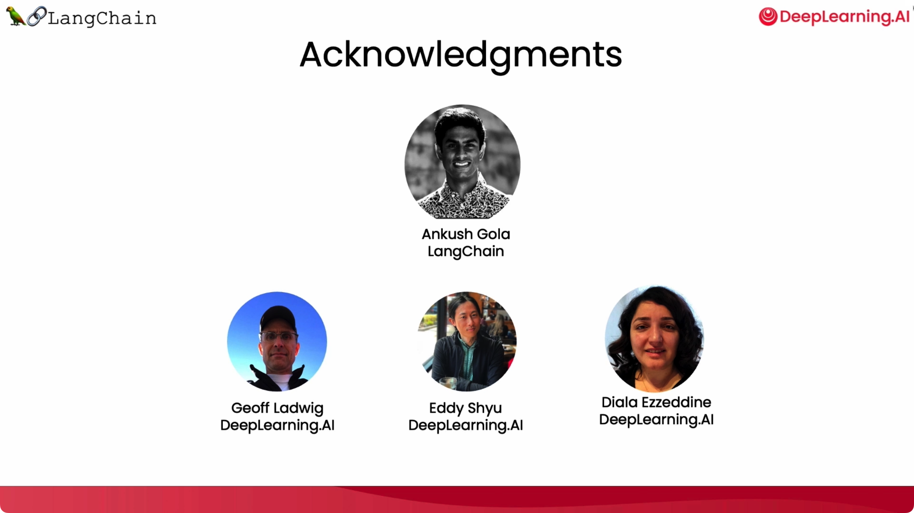

# 使用 LangChain 开发 LLM 应用：简介

> 注:
>
> 1.  本文是基于吴恩达《[LangChain for LLM Application Development](https://learn.deeplearning.ai/langchain/lesson/1/introduction)》课程的学习笔记；
> 2.  完整的课程内容以及示例代码/Jupyter笔记见：[LangChain-for-LLM-Application-Development](https://github.com/madroidmaq/LangChain-for-LLM-Application-Development)；

## 前言

本短期课程将为您介绍 [LangChain](https://github.com/hwchase17/langchain)，即大型语言模型应用程序开发。通过提示 LLM 或大型语言模型，现在可以比以往更快地开发 AI 应用程序。但是，应用程序可能需要多次提示 LLM 并解析其输出，因此需要编写许多粘合代码。[Harrison Chase](https://www.linkedin.com/in/harrison-chase-961287118) 创建的 LangChain 让这个开发过程更加容易。我很高兴有 Harrison 在这里，与 [deeplearning.ai](https://learn.deeplearning.ai/) 合作建立了这个短期课程，教授如何使用这个神奇的工具。感谢邀请，我非常激动能够在这里。

## LangChain 的起源

LangChain 起初是一个用于构建 LLM 应用程序的开源框架。当我与该领域的许多人交谈时，看到了一些公共的抽象，以及它们是如何被开发的。到目前为止，我们对社区广泛采用 LangChain 感到非常兴奋，期待与每个人分享它，并期待看到人们使用它构建的东西。实际上，作为 LangChain 势头的标志，它不仅有众多用户，而且还有成百上千的开源贡献者，这对其快速开发的速度至关重要。该团队以惊人的速度推动代码和特性的变化。

## LangChain 的价值

LangChain 是一个用于构建 LLM 应用程序的开源开发框架，具有 Python 和 JavaScript 两个不同的包。它们专注于组合和模块化，并具有许多可以单独或结合使用的独立组件。这是其中一个关键的价值点。

然后是许多不同的用例，即将这些模块化组件组合成更加端到端的应用程序，并使之非常容易开始这些用例。在这个课程中，我们将涵盖 LangChain 的常见组件。我们将讨论 Models、Prompts（如何让模型做有用和有趣的事情）、Indexs（摄入数据的方式，以便您可以将其与模型相结合）以及 Chains（更多的端到端用例）和 Agents（一种非常令人兴奋的端到端用例，它将模型用作推理引擎）。

## 致谢

我们还要感谢 [Ankush Gholar](https://www.linkedin.com/in/ankush-gola-77255866/)，他与 Harrison Chase 一起创立了 LangChain，对这些材料进行了深入的思考，并协助创建了这个短时课程。在 deeplearning.ai 方面，Jeff Ludwig、Eddie Hsu 和 Diala Ezzedine 也为这些材料做出了贡献。

下一个章节将要介绍 LangChain 的 Model、Prompt 和 Parsers 。
